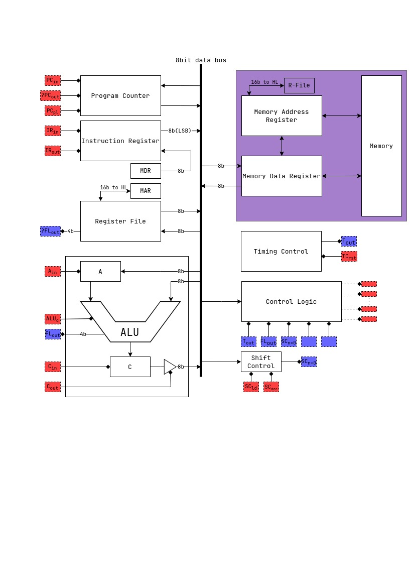

# The shmerlard 16

a 16 bit cpu based on the msp430 the jdh8 and the src cpu.
I used logisim for the logic design, draw.io for the diagrams.
in order to see the working cpu in logisim: you need to build version `3.9.0` from source [here](https://github.com/logisim-evolution/logisim-evolution/blob/main/docs/developers.md), then just open the `.circ` file.

## Specs

- a common 16-bit data and address bus
- a total of 128kB of usable memory
- 6 GP register (up to 14 available)
- modular design for easy troubleshooting
- port for outside connections

## Contents

1) [Registers](/Wiki/Register-File.md)
2) [Instruction Register](/Wiki/Instruction-Register.md)
3) [Program Counter](/Wiki/Program-Counter.md)
4) [ALU](/Wiki/ALU.md)
5) [Control Unit](/Wiki/ControlUnit.md)
6) [Memory Registers](/Wiki/Memory-Registers.md)

## Instruction set

```text
0x00:  NOP
0x01:  MOV  Ra/#, Rb       | Ra/# -> Rb
0x02:  LD   Ra/#, Rb       | M[Ra/#] -> Rb
0x03:  ST   Ra/#, Rb       | Rb -> M[Ra/#] ## might change the order of Ra Rb ##
0x04:  PUSH Ra/#           | SP - 1 -> SP; Ra/# -> @SP
0x05:  POP  Ra             | @SP -> Ra; SP + 1 -> SP
--- Arithmetic instructions ---
0x06:  ADD  Ra/#, Rb       | Ra/# + Rb -> Rb
0x07:  ADDC Ra/#, Rb       | Ra/# + Rb + c -> Rb
0x08:  SUB  Ra/#, Rb       | Rb - Ra/#-> Rb
0x09:  SHR  Ra/#, Rb       | SHR Rb (Ra/# times) -> Rb
0x0A:  RRC  Ra/#, Rb       | RRC Rb (Ra/# times) -> Rb
---------------------- Subroutiness  ---
0x0B:  CALL DST            | SP - 1 -> SP; PC -> @o match any number of path segments, including nono match any number of path segments, including nonSP; DST -> PC;   
0x0C:  RET                 | @SP -> PC; SP + 1  -> SP;             
0x0D:  CMP  Ra/#, Rb       | Rb - Ra/#                             
0x0E:        TST?????                       
0x0F:                          
0x10:                          
--- Logical operations      ---
0x11:  AND  Ra/#, Rb       | Ra/# AND Rb -> Rb
0x12:  OR   Ra/#, Rb       | Ra/# OR  Rb -> Rb                  
0x13:  XOR  Ra/#, Rb       | Ra/# XOR Rb -> Rb
0x14:  NOT  Ra Rb          | NOT Ra -> Rb
--- Input and output        ---
0x15:  IOR  Ra             | IOR -> Ra
0x16:  IOW  Ra/#           | Ra  -> IOR         
0x17:         
----------------------Conditional Jumps --------------------------
0x18:  JMP  DST            | DST -> PC  
0x19:  JEQ  DST            | (Z = 1 ):           DST -> PC 
0x1A:  JNE  DST            | (Z != 0):           DST -> PC   
0x1B:  JHS  DST            | (C = 0):            DST -> PC
0x1C:  JH   DST            | (C = 0)AND(Z != 0): DST -> PC
0x1D:  JLS  DST            | (C = 1)OR (Z = 0) : DST -> PC
0x1E:  JL   DST            | (C = 1)AND(Z != 0): DST -> PC
0x1F:                  
```

## [Registers](/Wiki/Register-File.md)

```text
0: SP/REG0  : STACK pointer    
1: SR/REG1  : Status register
2: REG2     : GP
3: REG3     : GP
4: REG3     : GP
5: REG4     : GP
6: REG5     : GP
7: REG6     : GP
```

## [Memory](/Wiki/Memory-Registers.md)

the memory ranges from `0x0000` to `0xFFFF`.
the memory is mapped in the following way:

```text
0x0000 - 0x7FFF: GP ROM              (32KiB    ROM)
0x8000 - 0xBFFF: GP RAM              (16KiB    RAM) 
0xC000 - 0xCFFF: VRAM                (4KiB    RAM) #CURRENTLY NOT IN USE#
0xD000 - 0xFFFF: NOT IN USE          (12KiB UNUSED)
```

## [Instruction format](/Wiki/Instruction-Register.md)

The instruction register is a 16-bit register

```text
the format is XXXX-XSSS-SAAA-DDDD
X = the opcode of the instruction
S = indicates the source register
A = indicates the addressing mode
D = indicates the destination register
```

(see [addressing modes](/Wiki/Instruction-Register.md#addressing-modes)) for more info

## TODOS

1) Whats the difference between my ram and logisim ram?
2) Implement more jmp conditions
3) Implement the HLT mechanic
4) relative addressing in the assembler
5) implement another adressing mode for low memory
6) add an option to correct mistakes in the excel
7) solve the carry problem
8) add addressing moded for single operand

## Full diagram


