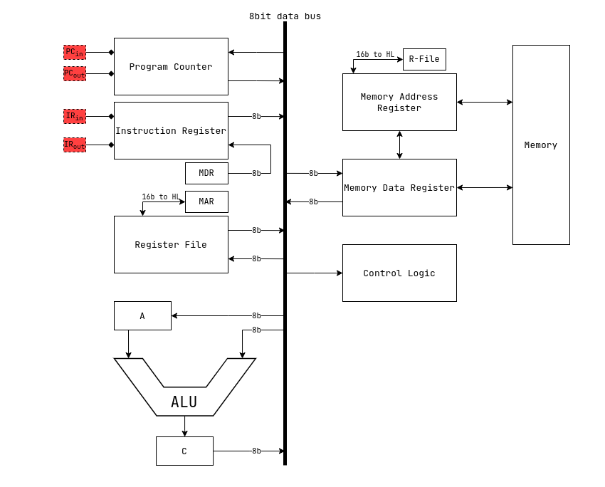

# The shmerlard 8
an 8 bit cpu

# Specs
- data line of 8 bit
- addresses of 16
- 4 GP register

# Commands
```
0: MOV  Ra/imm8     Rb          | Ra/imm8           -> Rb
1: LDW  HL/imm16    Rb          | M[HL/imm16]       -> Rb
2: STW  Ra          HL/imm16    | Ra                -> M[HL/imm16]
3: PUSH Ra/imm8                 | SP-- ; Ra/imm8    -> M[SP]
4: POP  Ra                      | M[SP] -> Ra ; SP++
5: LDA  imm16                   | imm16             -> HL
6: CMP* Ra          Rb          | Rb - Ra
7: JNZ                          | (Z != 0) : HL     -> PC
8: INB  Ra                      | INR               -> Ra
9: OUTB Ra                      | Ra                -> OUTR
A: ADD* Ra/imm8     Rb          | Ra/imm8 + Rb      -> Rb
B: ADC* Ra/imm8     Rb          | Ra/imm8 + Rb + C  -> Rb
C: SBB* Ra/imm8     Rb          | Rb - Ra/imm8 - B  -> Rb
D: OR   Ra/imm8     Rb          | Ra OR Rb          -> Rb
E: AND  Ra/imm8     Rb          | Ra AND Rb         -> Rb
F: NOP

(*) : FLAGS register is affected

Other Instructions that has to be simulated
CALL        RET         JZ      JLO     JH      JC      JEQ     JGE
SET(CZVN)   CLR(CZVN)   INC     INCD    DEC     DECD    NOT     JMP
```
# Registers
```
0: PC       : Program Counter register
1: REG A    : GP
2: REG B    : GP
3: REG C    : GP
4: REG D    : GP
5: REG L    : LOW address register
6: REG H    : HIGH address register
7: REG F    : FLAGS register
```
# Instruction format
The instruction register is an 8 bit register
```
the format is XXXXYZZZ
XXXX = the opcode of the instruction
Y    = indicates if its imm8/16; 0 if not; 1 if yes
ZZZ  = indicates the dst register
```

# Full diagram

