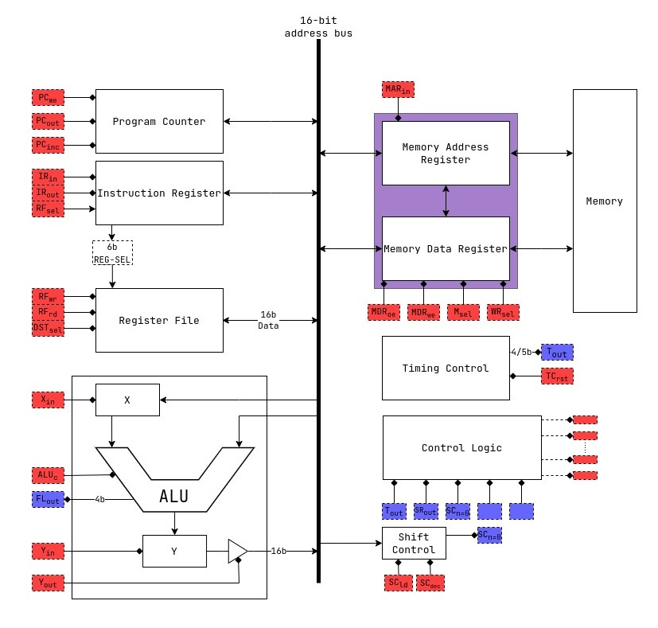

# The shmerlard 16

hi, my name is elad and Im an electrical engineering student in Ben gurion university.
I designed a small 16bit cpu, with a mix of jdh8, src, msp430 and the Hack computer.
this is still a work in progress, but so far it works.

I used logisim for the logic design, draw.io for the diagrams.
in order to see the working cpu in logisim: you need to build version `3.9.0` from source [here](https://github.com/logisim-evolution/logisim-evolution/blob/main/docs/developers.md), then just open the `.circ` file.

## Specs

- a common 16-bit data and address bus
- a total of 128kB of usable memory
- 6 GP register (up to 14 available)
- modular design for easy troubleshooting
- port for outside connections

## Contents

1) [Registers](/Wiki/Modules/Register-File.md)
2) [Instruction Register](/Wiki/Modules/Instruction-Register.md)
3) [Program Counter](/Wiki/Modules/Program-Counter.md)
4) [ALU](/Wiki/Modules/ALU.md)
5) [Control Unit](/Wiki/Modules/Control-Unit.md)
6) [Memory Registers](/Wiki/Modules/Memory-Registers.md)
7) [Condition Logic](/Wiki/Modules/Condition-Logic.md)
8) [Shift Control](/Wiki/Modules/Shift-Control.md)
9) [Gallery](/Wiki/Gallery.md)

## Instruction set

```text
0x00:  NOP
0x01:  MOV  Ra/#, Rb       | Ra/# -> Rb
0x02:  ST   Ra/#, Rb/#     | Ra/# -> M[Rb]/
0x03:  PUSH Ra/#           | Ra/# -> @SP; SP--
0x04:  POP  Ra             | SP++; @SP -> Ra
0x05:  ADD  Ra/#, Rb       | Ra/# + Rb -> Rb
0x06:  ADDC Ra/#, Rb       | Ra/# + Rb + c -> Rb
0x07:  SUB  Ra/#, Rb       | Rb - Ra/# -> Rb
0x08:  CMP  Ra/#, Rb       | Rb - Ra/#
0x09:  SHR  Ra/#, Rb       | SHR Rb (Ra/# times) -> Rb
0x0A:  SHL
0x0B:  RRC  Ra/#, Rb       | RRC Rb (Ra/# times) -> Rb
0x0C:  RLC
0x0D:  AND  Ra/#, Rb       | Ra/# AND Rb -> Rb
0x0E:  OR   Ra/#, Rb       | Ra/# OR  Rb -> Rb
0x0F:  XOR  Ra/#, Rb       | Ra/# XOR Rb -> Rb
0x10:  NOT
0x11:  CALL DST            | PC -> @SP; DST -> PC; SP-- -> SP;
0x12:  RET
0x13:  JMP  DST            | DST -> PC
```

for more simulated instructions see: [Simulated Instructions](/Wiki/Simulated-Instructions.md)

## [Registers](/Wiki/Modules/Register-File.md)

```text
0: SP/REG0  : STACK pointer    
1: SR/REG1  : Status register
2: REG2     : GP Input
3: REG3     : GP Output
4: REG3     : GP
5: REG4     : GP
6: REG5     : GP
7: REG6     : GP
```

## [Memory](/Wiki/Modules/Memory-Registers.md)

the memory ranges from `0x0000` to `0xFFFF`.
the memory is mapped in the following way:

```text
0x0000 - 0x7FFF: GP ROM              (32KiB    ROM)
0x8000 - 0xBFFF: GP RAM              (16KiB    RAM) 
0xC000 - 0xCFFF: VRAM                (4KiB    RAM) #CURRENTLY NOT IN USE#
0xD000 - 0xFFFF: NOT IN USE          (12KiB UNUSED)
```

## [Instruction format](./Wiki/Modules/Instruction-Register.md)

The instruction register is a 16-bit register

```text
the format is XXXX-XUMM-SSSS-DDDD
X = the opcode of the instruction
U = Currently not in use
M = indicates the addressing mode
S = indicates the source register
D = indicates the destination register
```

(see [addressing modes](/Wiki/Modules/Instruction-Register.md#addressing-modes)) for more info

## TODO's

| Board         | Logisim   | SCH Design| SCH Test  | PCB Design| Order | Assemble  | Final Test    |
| -----         | :-----:   | :--------:| :------:  | :-------: | ----- | --------  | ---------     |
| Register File | YES       | YES       | YES       | YES       | NO    | NO        | NO            |

## Full diagram

for the full gallery go to [Gallery](Wiki/Gallery.md)


