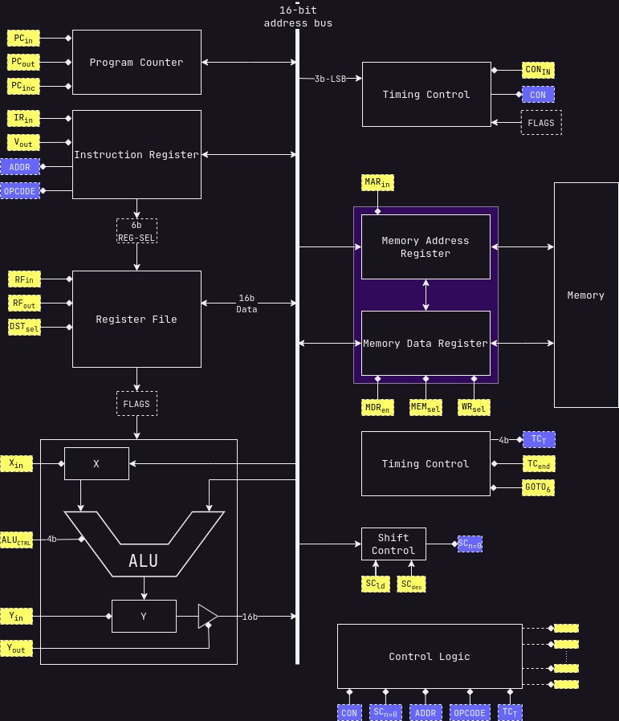

# The shmerlard 16

hi, my name is elad and Im an electrical engineering studern in Ben gurion university.
I designed a small 16bit cpu, with a mix of jdh8, src, msp430 and the Hack computer.
this is still a work in progress, but so far it works.

I used logisim for the logic design, draw.io for the diagrams.
in order to see the working cpu in logisim: you need to build version `3.9.0` from source [here](https://github.com/logisim-evolution/logisim-evolution/blob/main/docs/developers.md), then just open the `.circ` file.

## Specs

- a common 16-bit data and address bus
- a total of 128kB of usable memory
- 6 GP register (up to 14 available)
- modular design for easy troubleshooting
- port for outside connections

## Contents

1) [Registers](/Wiki/Modules/Register-File.md)
2) [Instruction Register](/Wiki/Modules/Instruction-Register.md)
3) [Program Counter](/Wiki/Modules/Program-Counter.md)
4) [ALU](/Wiki/Modules/ALU.md)
5) [Control Unit](/Wiki/Modules/ControlUnit.md)
6) [Memory Registers](/Wiki/Modules/Memory-Registers.md)
7) [Condition Logic](/Wiki/Modules/Condition-Logic.md)
8) [Shift Control](/Wiki/Modules/Shift-Control.md)
9) [Gallery](/Wiki/Gallery.md)

## Instruction set

```text
0x0:  MOV  Ra/#, Rb       | Ra/# -> Rb
0x1:  PUSH Ra/#           | Ra/# -> @SP; SP--
0x2:  POP  Ra             | SP++; @SP -> Ra
0x3:  ADD  Ra/#, Rb       | Ra/# + Rb -> Rb
0x4:  ADDC Ra/#, Rb       | Ra/# + Rb + c -> Rb
0x5:  SUB  Ra/#, Rb       | Rb - Ra/#-> Rb
0x6:  SHR  Ra/#, Rb       | SHR Rb (Ra/# times) -> Rb
0x7:  RRC  Ra/#, Rb       | RRC Rb (Ra/# times) -> Rb
0x8:  CALL DST            | PC -> @SP; DST -> PC; SP-- -> SP;
0x9:  RET                 | SP + 1  -> SP; @SP -> PC;
0xA:  AND  Ra/#, Rb       | Ra/# AND Rb -> Rb
0xB:  OR   Ra/#, Rb       | Ra/# OR  Rb -> Rb
0xC:  XOR  Ra/#, Rb       | Ra/# XOR Rb -> Rb
0xD:  
0xE:
0xF:  JMP  DST            | DST -> PC
```

for more simulated instructions see: [Simulated Instructions](/Wiki/Simulated-Instructions.md)

## [Registers](/Wiki/Modules/Register-File.md)

```text
0: SP/REG0  : STACK pointer    
1: SR/REG1  : Status register
2: REG2     : GP
3: REG3     : GP
4: REG3     : GP
5: REG4     : GP
6: REG5     : GP/Input REG ## NOT YET IMPLEMENTED
7: REG6     : GP/Output REG ## NOT YET IMPLEMENTED
```

## [Memory](/Wiki/Modules/Memory-Registers.md)

the memory ranges from `0x0000` to `0xFFFF`.
the memory is mapped in the following way:

```text
0x0000 - 0x7FFF: GP ROM              (32KiB    ROM)
0x8000 - 0xBFFF: GP RAM              (16KiB    RAM) 
0xC000 - 0xCFFF: VRAM                (4KiB    RAM) #CURRENTLY NOT IN USE#
0xD000 - 0xFFFF: NOT IN USE          (12KiB UNUSED)
```

## [Instruction format](/Wiki/Modules/Instruction-Register.md)

The instruction register is a 16-bit register

```text
the format is XXXX-SSSS-FAAA-DDDD
X = the opcode of the instruction
S = indicates the source register
A = indicates the addressing mode
D = indicates the destination register
```

(see [addressing modes](/Wiki/Modules/Instruction-Register.md#addressing-modes)) for more info

## TODOS

1) Whats the difference between my ram and logisim ram?
2) Implement more jmp conditions
3) relative addressing in the assembler
4) add an option to correct mistakes in the excel
5) solve the carry problem

## Full diagram

for the full gallery go to [Gallery](Wiki/Gallery.md)


