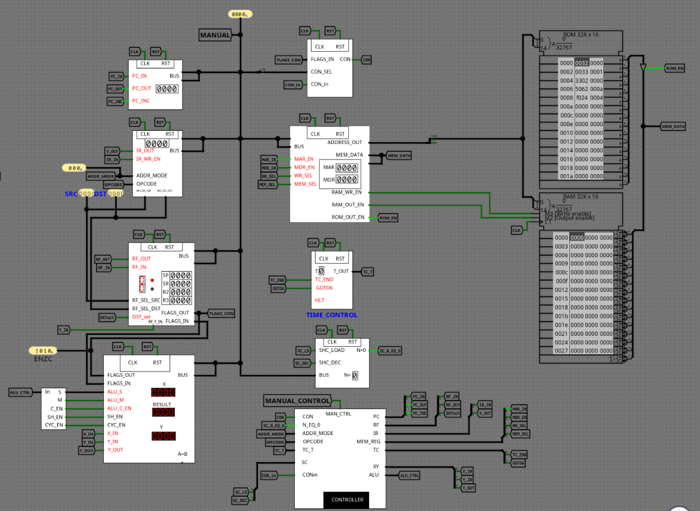
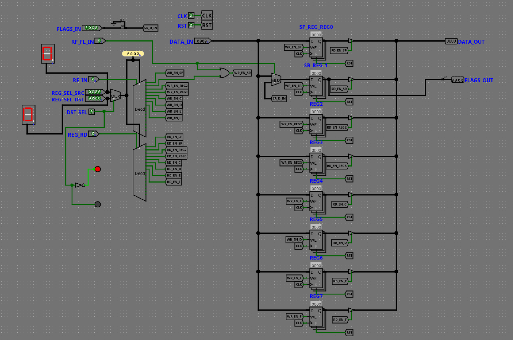
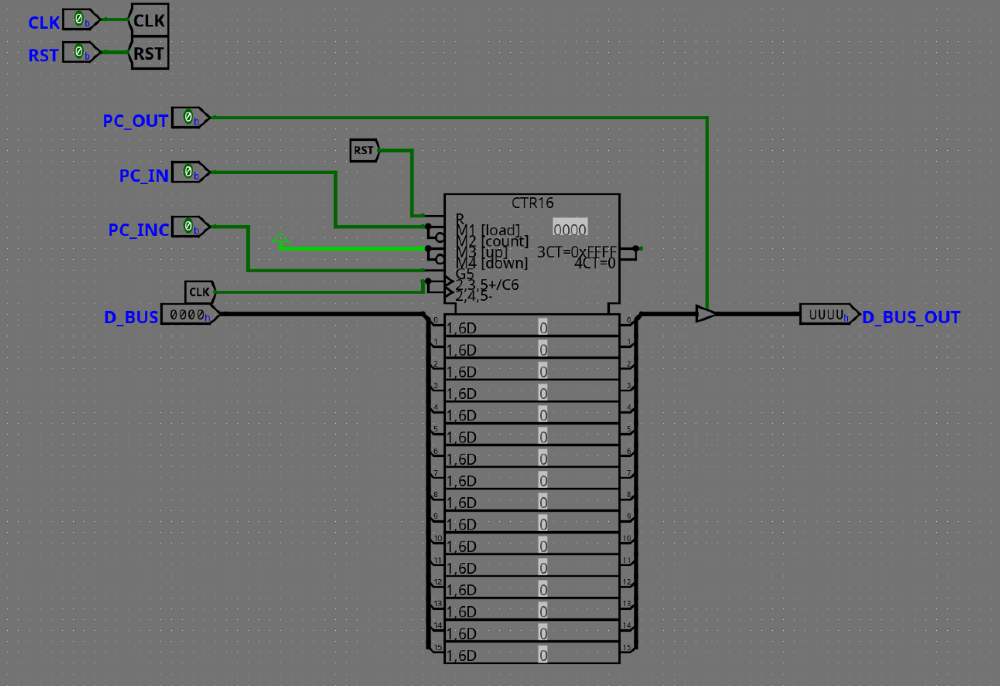
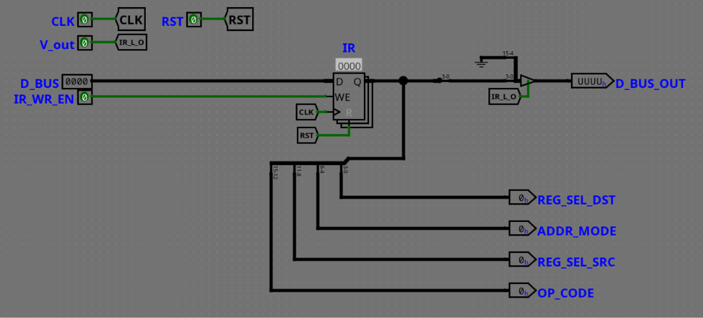
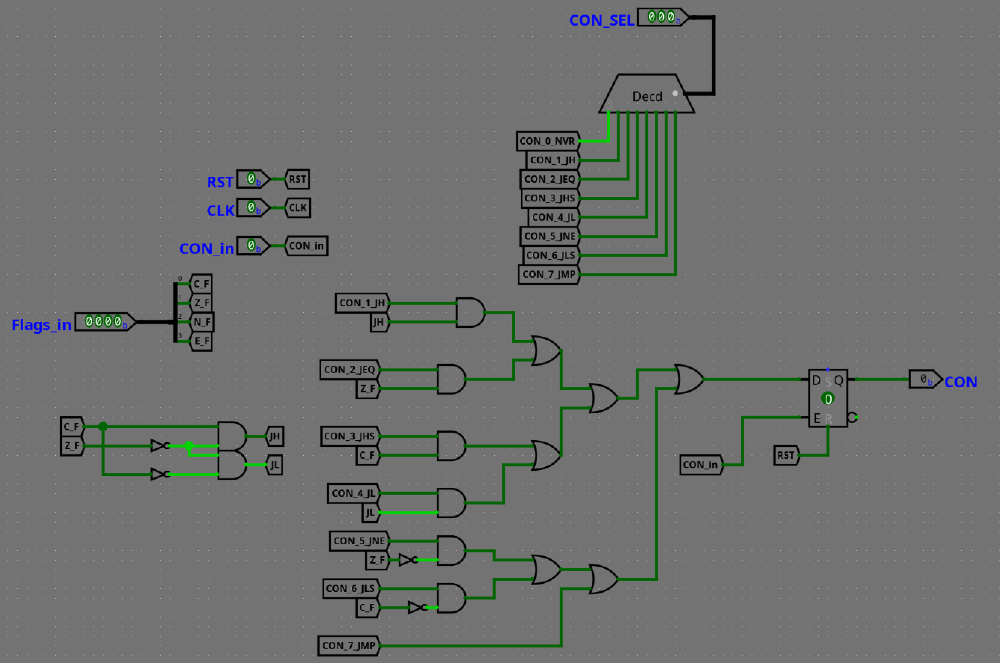
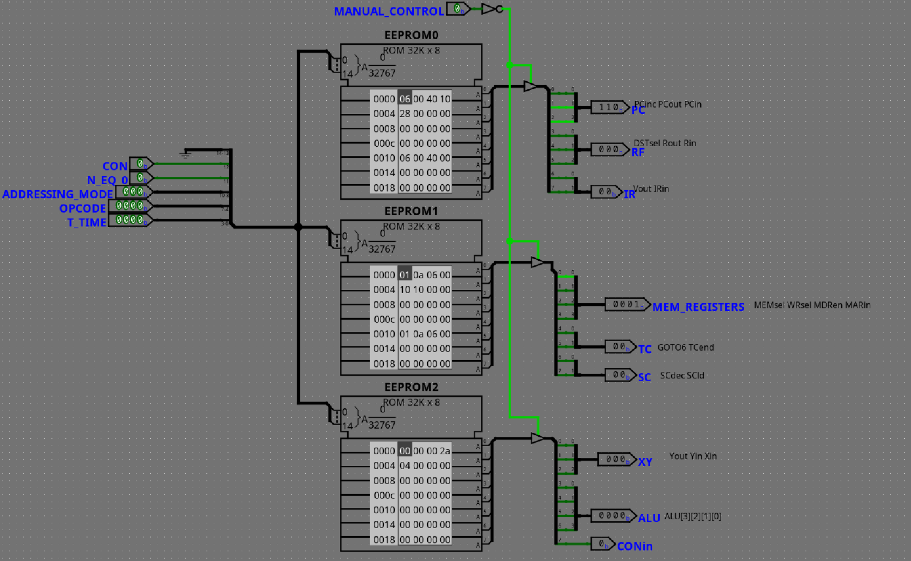
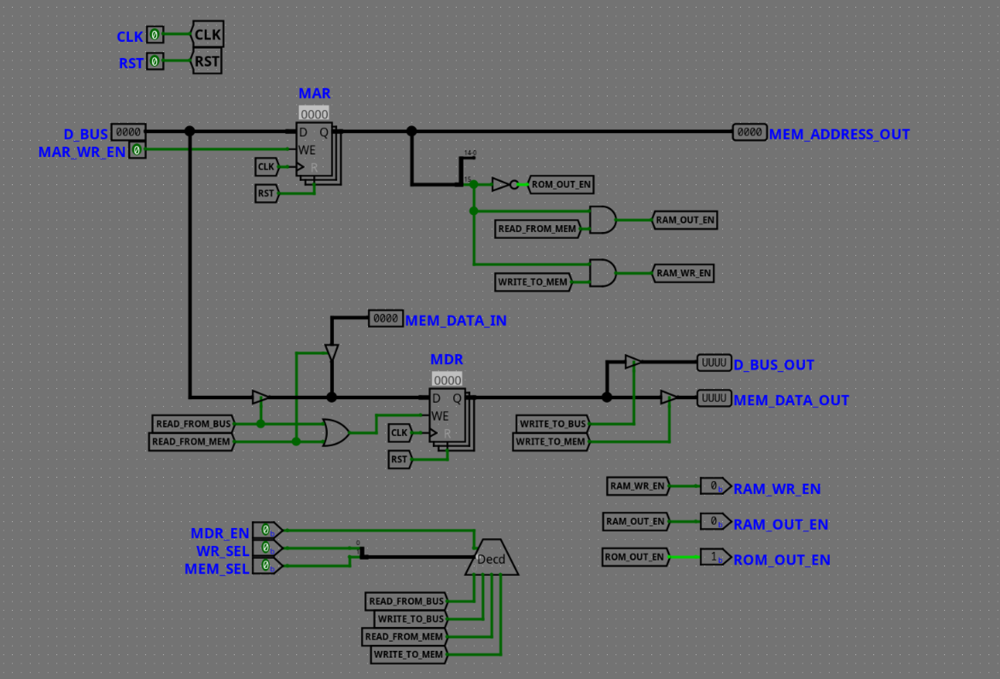
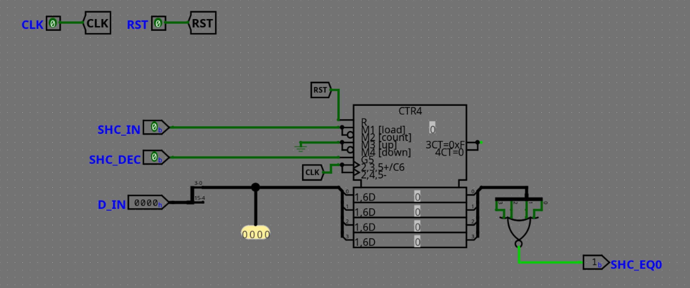
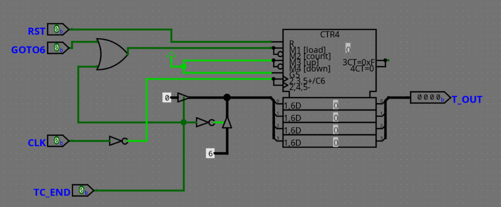

# Gallery

## Main view

## The register file

## The program counter

## The instruction register

## The ALU

## The conddition control

## Control logic

## Memory registers

## Shift control

## Timing control

