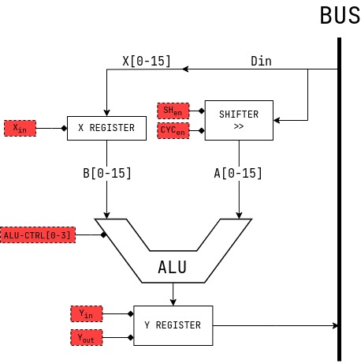

# The ALU


The ALU is the unit performing arithmetic and logical operations.
the ALU also contains 2 registers, X and Y. X is for the input, Y is for the output.
i used 4 74ls181 chips for the alu, but since the chip doesnt have a shifting mechanic another one is used.
in

since the 74ls181 chip has 6 inputs, and the shifter has another 2, we will need a full eeprom just for the mode of operation of the alu (even without `Xin Yin You`), but we don't need every possible output of the alu so first I've listed function that we are going to need.
and second I've listed the required control lines.
since we have less then 16 possible functions, we can represent them in 4 bits.
I've used to combinatorical analysis function in Logisim to find a matching circuit to "Translate" between the input that will be called `ALU_CTRL` and the control lines that will control the 74181 chips.
this circuit can be built in real life either by individuals logic gates or by an eeprom.

the alu has the folowing control lines:

```text
0x0: ADD
0x1: ADDC
0x2: SUB
0x3: AND
0x4: OR
0x5: XOR
0x6: NOT
0x7: Y=A
0x8: Y=X
0x9: SHR
0xA: RRC
0xB: SHL
0xC: RLC
0xD: DECA
0xE: INCA
0xF:
```

according to the [datasheet](/Datasheets/74181.pdf) we are going to need the following:

```text
0x0: ADD : F = A PLUS  B        : S = 0x9; M = 0; SH_EN = 0; CARRY_EN = 0
0x1: ADDC: F = A PLUS  B PLUS C : S = 0x9; M = 0; SH_EN = 0; CARRY_EN = 1
0x2: SUB : F = A MINUS B        : S = 0x6; M = 0; SH_EN = 0; CARRY_EN = 0
0x3: AND : F = A AND B          : S = 0xB; M = 1; SH_EN = 0;
0x4: OR  : F = A OR  B          : S = 0xE; M = 1; SH_EN = 0;
0x5: XOR : F = A XOR B          : S = 0x6; M = 1; SH_EN = 0;
0x6: NOT : F = NOT A            : S = 0x0; M = 1; SH_EN = 0;
0x7: Y=A : F = A                : S = 0xF; M = 1; SH_EN = 0;
0x8: Y=X : F = B                : S = 0xA; M = 1; SH_EN = 0;
0x9: SHR : Shift right A        : S = 0xF; M = 1; SH_EN = 1; CYC_EN = 0; LFT_SEL = 0
0xA: RRC : Shift right cyclic A : S = 0xF; M = 1; SH_EN = 1; CYC_EN = 1; LFT_SEL = 0
0xB: SHR : Shift left A         : S = 0xF; M = 1; SH_EN = 1; CYC_EN = 0; LFT_SEL = 1
0xC: RRC : Shift left cyclic A  : S = 0xF; M = 1; SH_EN = 1; CYC_EN = 1; LFT_SEL = 1
0xD: Y=DECA:                    : S = 0xF; M = 0; SH_EN = 0; CARRY_EN = 0
0xE: Y=INCA:                    : S = 0x0; M = 0; SH_EN = 0; CARRY_EN = 0 
```

## the shifting mechanic

since the 74181 chip doesnt include a shift right option, another circuit is made to do this, the circuit is connected between the bus and the A input of the alu and has 2 control lines, one is `SH_EN` for enabling shifting and the other is `CYC_EN` for enabling rotation, so if I want to shift left register 5 all I have to do is:
1) output register 5 to the bus
2) enable `SH_EN` and `Y=A` 
3) enable `Yin` for to save the resault
4) output Y register to `R5`
